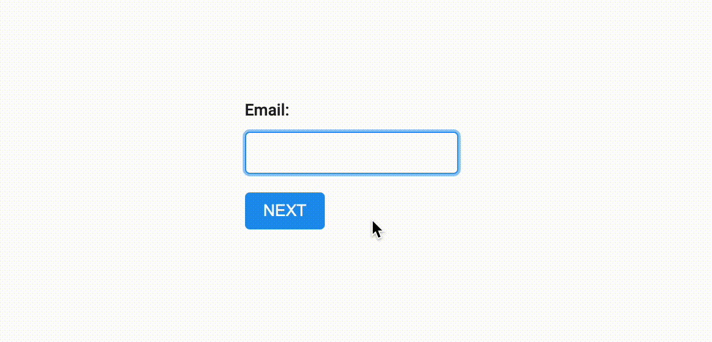

# Finite State Machine in React Showcase

## Introduction

This a very simple form for an email subscription. Finite state model is linear.



## Getting Started

Run MongoDb database (you need to have Docker installed):

```sh
docker compose up -d
```

Install dependencies:

```sh
npm install
```

Run frontend & backend:

```sh
npm run dev
```

## Process

Initially I started with `xstate` just to play out.

You can still find this version in the `xstate-version` branch if you're curious.

Afterwards I've tried to use `useState` to implement a custom `useMachine` hook.

At some point I stumbled over a very clever idea to use `useReducer`, which I used in the end.

Of course, this is a very simple version with data still being managed with `useState` and actions being performed by handlers.

## What can be improved

- Bundle feels pretty large and requires trimming. Mainly caused by monorepository structure. Will focus on it on later iterations.
- No tests, sorry.
- Styles require work. I would still prefer using MUI or Tailwind just to save time.
- Quite a few `any`'s in TypeScript.
- React 18 does its thing with firing `useEffect` [twice](https://beta.reactjs.org/learn/synchronizing-with-effects#how-to-handle-the-effect-firing-twice-in-development).
- Email is not validated and can be left empty.
- Browser's back and forward buttons don't work properly.
- Subscriptions are not saved on the backend.
- Some debugging output here and there.
